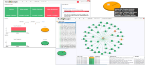

---

- [Overview](#overview)
- [Getting Started](#getting-started)
- [License](#license)
- [Contributions](#contributions)

# Overview
RealOpInsight leverages probes status from Kubernetes®, Zabbix® and/or Nagios® to feature upon that application-specific high-level visualization to track the availability of applications over time. 

Key features:

  * **Monitor business values, Define & track SLA/SLO targets:** Focus on the applications that underlie your business, set up application-aware notifications, measure, observe and analyze applications availability over time. Be able to easily evaluate the real impact of each incident.
  * **Federated & unified applications monitoring:** Break silos by setting up unified applications monitoring operations views that hide the underlying monitoring systems while helping you solving incidents with relevant business priorities.
  * **Relationship mapping & event correlation:** Map relationships among application components, set up specific business-oriented policies to handle and propagate each incident with appropriate business impact.
  * **Simple and secured integration through API:** Don't waste time on complex configuration tasks, just a couple of minute is required to deploy and get started with RealOpInsight.
  * **Tactical Operations Dashboards:** For operations staff or executive, build specific tactical dashboards to get quick insight on how your applications are operating, be able to get details in one click.
  * Open source licensed under the terms of [GPL v3 Licence](LICENSE).

# Getting Started
  * [Deployment on Kubernetes](./docs/deployement-on-kubernetes.md)
  * [Deployment on Docker](./docs/deployement-on-deployment-on-docker.md)
  * [Integration with Kubernetes](https://realopinsight.com/docs/quickstart-kubernetes-dashboard/)
  * [Integration with Zabbix](https://realopinsight.com/docs/quickstart-zabbix-dashboard/)
  * [Integration with Nagios and alike](https://realopinsight.com/docs/quickstart-nagios-icinga-centreon-dashboard/)
  * [Design fundamentals](https://realopinsight.com/docs/monitoring-data-sources/)

> Default credentials: username => `admin`, password => `password` (should be changed).

# License
RealOpInsight is licensed under the terms of [GPLv3 License](LICENSE), mainly due to copyleft contamination by third-party software to which it's bound (e.g. [Qt](https://www.qt.io/), [Wt](https://www.webtoolkit.eu/wt)).

# Contributions
Contributions in any forms are welcomed (feedback, code, documentation, etc).

RealOpInsight is developed using C++14 and is bound the [Qt](https://www.qt.io/) and [Wt](https://www.webtoolkit.eu/wt) frameworks. 
Having fundamentals to develop software in C++11 or higher is required. 
It may be helpful, but not required, to have experience building software with Qt and Wt.
