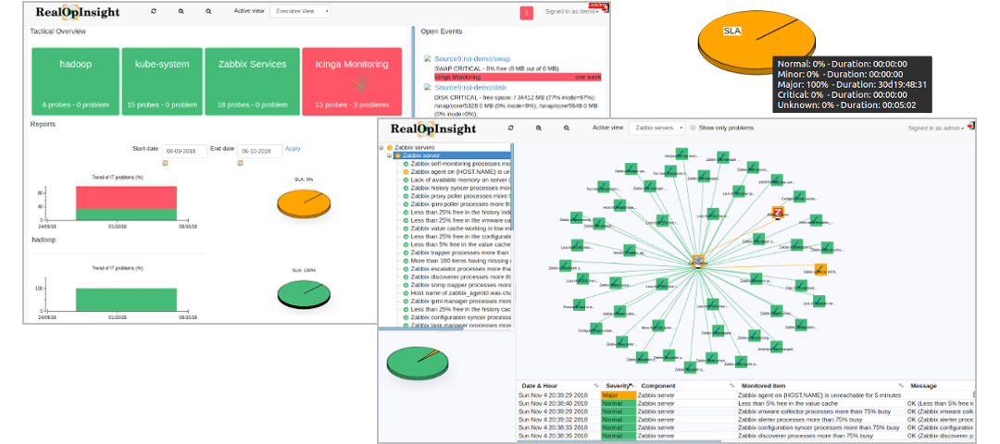

# Overview
RealOpInsight is an open source tool providing federated dashboards for application operations monitoring on top of Kubernetes®, Zabbix®, Nagios® and alike (Centreon®, Icinga®...).

Among others, RealOpinsight features include:

* **Tactical Dashboards:** Whether you're an operations staff or executive, RealOpInsight provides tactical dashboards that allow you to have a quick insight on how your applications are operating while be able to have more details in one click.
* **Federated & Unified Monitoring:** RealOpInsight allows you to collect and consolidate data from a wide range of distributed and heterogeneous monitoring systems and provide to your operations staffs unified application operations dashboards.
* **Monitoring of Business Values:** by allowing you Focus on applications that underlie your business services. You can fire notifications at application-level, and easily generate availability reports over time.
* **Relationship Mapping & Event Correlation:** Map relationships among your applications' components along with custom severity calculation and propagation policies to meet your specific management needs.
* **Quick API-based Integration:** Don't waste time on complex or boring configuration tasks, RealOpInsight only requires a read-only access to the API of the monitoring data collection backends (i.e. Kubernetes API, Zabbix API...)
* **Open Source:** RealOpInsight is full open source, built with interoperability as basic concept. It's released under GPLv3 license. Commercial use with no copy-left is subject to specific agreements.



# Installation

RealOpInsight can be easily installed using one of the following methods:

* Binaries for Ubuntu Server 16.04 LTS.
* Docker -image based on Ubuntu Server 16.04 LTS.
* Virtual machine images (Open Virtualization Format, OVF 2.0), a.k.a virtual machine image, based on Ubuntu Server 16.04 LTS. The appliance can be installed on VirtualBox, VMware, or any other OVA-compatible hypervisors.

## Installation via Docker
The following command will pull and start a Docker instance of RealOpInsight in background.

```
$ docker run -d \
  --name realopinsight \
  --network host \
  --publish 4583:4583 \
  rchakode/realopinsight
```

Once the container started, the RealOpinsight web interface can be accessed on on your local machine at http://127.0.0.1:4583/realopinsight/.

You can then move to the Getting Started section for more instructions.

## Installation via a Virtual Machine Image (OVF 2.0)
The following steps describe how to install RealOpInsight using an OVF image on [Oracle VirtulaBox](https://www.virtualbox.org/). You can easily adapt the steps if you use a VMware virtualization tool instead.

* Go to the [release page](https://github.com/RealOpInsightLabs/realopinsight/releases) and get the latest OVF distribution archive.
* Unzip the distribution archive, you will obtain an OVA (Open Virtualization Appliance) file.
* If not yet the case [donwload and install VirtualBox](https://www.virtualbox.org/wiki/VBoxInstallAndRun).
* Launch VirtualBox and select the menu `File -> Import Virtual Appliance`.
* Browse your file system and select the OVA file of RealOpInsight.
* Review the default virtual machine settings. You would likely consider to change the hardware requirements according to your needs (i.e. memory, CPU, network, etc).
* Validate the importation and wait that the process completes. That may take a few minutes.
* Once the virtual machine started, the RealOpinsight web interface can be accessed on on your local machine at [http://<VM_ADDR>:4583/realopinsight](http://VM_ADDR:4583/realopinsight/) (replace `<VM_ADDR>` by the IP address or the hostname of the virtual machine).

You can then move to the Getting Started section for more instructions.

## Installation/Upgrade via a Binary Distribution

* Log on the machine that will host RealOpInsight.
* Install Graphviz dependency

  ```
  $ sudo apt-get install graphviz
  ```      

* Go to the [release page](https://github.com/RealOpInsightLabs/realopinsight/releases) and get the latest binary distribution tarball.
* Uncompress the archive, move to the distribution directory, and start the installation process:

  ```
    $ tar zxf realopinsight-ultimate-<VERSION>.ubuntu1404.x86_64.tar.gz       
    $ cd tar zxf realopinsight-ultimate-<VERSION>.ubuntu1404.x86_64
    $ sudo ./install-ultimate-distrib.sh
  ```

    Replace `<VERSION>` with the downloaded version

* When prompted, you must accept the license terms in order to move forward.
* When prompted to select the type of installation you want to perform.
    * Type `n` to proceed with a new installation.
    * Type `u` to proceed with an installation update; you will be then prompted to provide additional information regarding your existing installation.
* Once the virtual machine started, the RealOpinsight web interface can be accessed on on your local machine at [http://<HOST_ADDR>:4583/realopinsight](http://VM_ADDR:4583/realopinsight/) (replace `<HOST_ADDR>` by the IP address or the hostname of your the installation server).

You can then move to the Getting Started section for more instructions.

# Getting Started

According to the installation option you selected, open the RealOpInsight web interface and login as administrator (username: `admin`, password: `password`).

For production use, the default password must be changed password as soon as possible for security reasons.

## Integration with Kubernetes
For an integration with Kubernetes, you will need, off course, a running Kubernetes cluster; a Minikube installation should do the trick.

Then proceed as the follows:

* Install kubectl on the machine running RealOpInsight; if you opted for a containerized instance, kubectl should be installed on the Docker host.
* Open a proxied access to Kubernetes API:
  ```
    $ kubectl proxy
  ```
* Log into RealOpInsight as administrator (default credentials: `admin`/`password`).
* Select the menu `Monitoring Sources` to fill in the monitoring source settings.
* Set the field `Monitoring Source Type` to `Kubernetes`.
* Set the field `Monitor API Base URL` to `http://127.0.0.1:8000/` (assuming that you started a proxy access to Kubernetes API with default options).
* Leave the other fields as is.
* Click on the button `Add as source`.
* When prompted, select `Source0` as `Source Id`.
* Click on `Apply` to save the changes.
* On success you shall see a message confirming that.


## Integration with Zabbix
You will need, off course, a running Zabbix installation with its JSON-RPC API enabled. Zabbix version 1.8 or higher is required.

Then proceed as follows:

* Log into RealOpInsight as administrator.
* Select the menu `Monitoring Sources` to fill in the monitoring source settings.
* Set the property `Monitoring Source Type` to `Zabbix`.
* Set the property `Monitor API Base URL` with the URL of Zabbix web interface (e.g. _https://zabbix-server/zabbix/_, assuming that Zabbix is installed on a server named `zabbix-server` and accessible over HTTPS).
* Check the property `Don't verify SSL certificate` **only** if you use a self-signed certificate.
* Set the property `Auth String` with a string `username:password` corresponding to the credentials to connect to Zabbix API. Note the colon `:` between username and password.
* Click on the button `Add as source`.
* When prompted, select `Source0` as `Source Id`.
* Click on `Apply` to save the changes.
* On success you shall see a message confirming that.

## Integration with Nagios and related systems
The below steps apply to all systems based on Nagios concepts, i.e Nagios itself, Centreon, Icinga, Op5 Monitor, etc.

To integrate RealOpInsight with these systems, you have to proceed as follows:

* Install a networked [Livestatus service](https://mathias-kettner.com/cms_livestatus.html) over your monitoring data. Note that Icinga 2 provides a reimplementation of the Livestatus protocol that can be easily [setup over an Icinga2 installation](https://icinga.com/docs/icinga2/latest/doc/14-features/#livestatus).
* For a sake of simplicity for the rest of this document we assume that the networked Livestatus service uses the following configuratin for xinetd. According to your installation you may likely need to modify the following: `server_args` that points to the Livestatus socket, `server` pointing to the unixcat binary, `user` defining a user having read permissions to the Livestatus socket.

  You can modify these settings, save the resulting configuration in a file located at `/etc/xinetd.d/livestatus`, and restart xinetd.

    ```
    service livestatus
    {
      type        = UNLISTED
      port        = 6558
      socket_type = stream
      protocol    = tcp
      wait        = no
      cps         = 100 3
      instances   = 500
      per_source  = 250
      flags       = NODELAY
      user        = nagios
      server      = /usr/bin/unixcat
      server_args = /var/lib/nagios/rw/live
      disable     = no
    }
    ```
* Log into RealOpInsight as administrator (default credentials: `admin`/`password`).
* Select the menu `Monitoring Sources` to fill in the monitoring source settings.
* Set the property `Monitoring Source Type` to `Nagios`.
* Set the property `Livestatus Host ` with the hostname or the IP address of the Livestatus network listener. This would be typically the address of your monitoring server, but you can also imagine a tunnelled remote access from another machine (e.g. RealOpInsight host).
* Set the property `Livestatus Port ` with the port of the Livestatus network listener (e.g. _6558_ with is the default port used set by MK Livestatus and Icinga).
* Leave all the other properties as is.
* Click on the button `Add as source`.
* When prompted, select `Source0` as `Source Id`.
* Click on `Apply` to save the changes.
* On success you shall see a message confirming that.

# Copyrights & License
This project bas been initiated by Rodrigue Chakode.

The software is licensed under the terms of GPLv3 License, mainly due to contamination by third-party systems that the software is bound to. All those third-party systems offer dual licenses (e.g. for proprierary uses), subject to pay some license fees. You can contact us you're insterested in such a use.

# Contributions
Contributions are welcome!

* Give a feedback,submit a bug when you find something that does not work as expected, or give a star are good starting points to start contributing. 
* You can also contribute bug patches or new features. In this case please use the Github Pull Request model. It is assumed that code and documentation are contributed under the same terms of use as the base code.
* You can even contribute by funding features. The project team will then work with you to understand your requirements so to build features to fillful them. When those features are published we will add specific advertizing regarding your funding.
