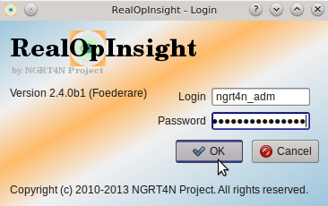
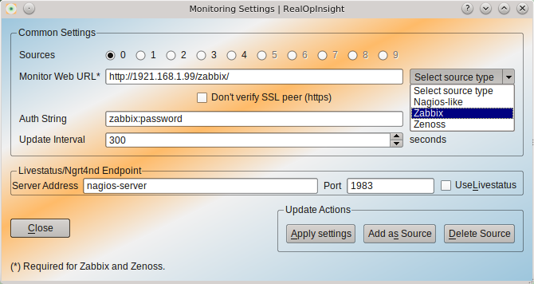

=====================================
Configuration
=====================================
This chapter describes how to configure RealOpInsight. 
It's recommended to read carefully the prerequisites section before moving
forward.

Prerequisites
-------------

As introduced in the :doc:`concepts guide <../overview/concepts>`, 
RealOpInsight uses different approaches to retrieve data from the 
underlying monitoring servers, also called monitoring sources:

+ For Zabbix and Zenoss, it relies on their native RPC APIs: `JSON-RPC`_ 
  for Zabbix and `JSON API`_ for Zenoss.
+ To retrieve data from Nagios, Shinken, Icinga, Groundwork, op5,
  Centreon and other Nagios-derived systems that do not enable native
  APIs, it relies either on :doc:`ngrt4nd <../adminguide/installing-ngrt4nd>`, 
  on MKLivestatus [#mkls]_ or on Shinken Livestatus [#shinkenls]_. 
  The Livestatus APIs must be enabled over the network. You can see the 
  :doc:`FAQ <../faq>` to learn how to do that.

Since the version 2.4.0, RealOpInsight can handle monitoring views
relying on many monitoring sources.

The support of multi-source views brings few changes concerning how
data points are defined and handled. However, a special effort has
been made to keep backward-compatibility with monitoring views edited
from a former version. This is important to note. Since you don't need
to care about multi-source handling when your monitoring view rely on
only a single monitoring source.

.. warning::

  Important: If you're using a version earlier than the version 2.4.0,
  we recommand to follow the `former configuration guide`_.

To upgrade to the version 2.4.0, you need to reset your configuration
settings. Otherwise, the Operations Console would be able to connect
to the remote API endpoint.

Launch the Configuration Manager
--------------------------------

On GNU/Linux and OS X systems, launch a terminal and run the following
command:

::

    $ ngrt4n-manager -c

On Windows, you can use the command from a terminal or simply use the
Start menu:

::

    Start->NGRT4N Monitoring Suite->RealOpInsight Configuration Manager

Once the login window loaded, sign in as administrator (l
default password: *ngrt4n_adm*).

    
  Screenshot of the Login Window

After successful authentication, the configuration manager will be loaded.

  
  Screenshot of the Configuration Manager

Description of Configuration Parameters
---------------------------------------

As described in the following table, some of configuration parameters
may be required, optional, or not applicable(NA) at all according to
the underlying monitoring system.

+-----------------+-----------------+---------------+--------------------------------------------+
| Parameter       | Nagios/derived  | Zabbix/Zenoss | Description                                |
+=================+=================+===============+============================================+
| Monitor Web URL | Optional        | Required      | Sets the URL to the web interface of the   |
|                 |                 |               | monitoring server.                         |
|                 |                 |               | E.g. http://nagios-server/nagios/          |
+-----------------+-----------------+---------------+--------------------------------------------+
| Auth String     | - Required with | Required      | Sets the token for authenticating          |
|                 |   ngrt4nd       |               | against the remote API endpoint:           |
|                 | - NA with       |               |                                            |
|                 |                 |               | - With Zabbix and Zenoss, this should      |                                          
|                 |   Livestatus    |               |   be set with a couple *login:password*    |      
|                 |                 |               |   (note the colon *:*) representing a      |    
|                 |                 |               |   valid user account. Prior to Zabbix 2.0, | 
|                 |                 |               |   this user MUST belong to the group       |
|                 |                 |               |   *API Access*;                            |
|                 |                 |               | - With ngrt4nd, this corresponds to its    |
|                 |                 |               |   `authentication token`_                  |
+-----------------+-----------------+---------------+--------------------------------------------+
| Server Address  | Required        | NA            | Sets the IP address or the hostname of the |
|                 |                 |               | monitoring server.                         |
|                 |                 |               | e.g. server.example.com                    |
+-----------------+-----------------+---------------+--------------------------------------------+ 
| Port            | Required        | NA            | Sets the port on which ngrt4nd or the      |
|                 |                 |               | Livestatus API is listening on on the      |
|                 |                 |               | monitoring server.                         |
|                 |                 |               | Eg. 1983 for ngrt4nd                       |
+-----------------+-----------------+---------------+--------------------------------------------+
| Update Interval | Required        | Required      | Set the interval after which the           |
|                 |                 |               | Operations Console will be refreshed       | 
|                 |                 |               | with new status information retrieved      | 
|                 |                 |               | from the monitoring servers                |
+-----------------+-----------------+---------------+--------------------------------------------+

Basic/single-source configuration
------------------------------------

Here are basic steps:

1. `Launch the Configuration Manager`_ and set parameters according to
   the target monitoring system.
2. Make sure to select the appropriate source type via the related
   combox on the form.
3.  Click on *Apply Settings* to save changes.
4. And finally, click on *Close* to quit the configuration window.

At any time, you can rerun the configuration manager to update
settings. A quick access is enabled via the menu *Console->Monitoring
Settings* from the Operations Console.

Multiple-source configuration
-----------------------------------------------------

Here we assume that you are familar with a basic configuration as
described in the last section. There are also some important notices
about sources management:

+ RealOpInsight can manage up to ten sources per service view
  simultaneously.
+ Each source has an identifier in the form of *"Source"+Index*, where
  Index comprised between 0 and 9 corresponds to the index of the source
  (E.g. Source0, Source2). See on the screenshot of the Configuration
  Manager for more details.
+ To associate a data point to a given source, you need to prefix the
  data point with the source identifier as follow:
  *SourceIndex:device/probe* (note the colon *':' *separator) *.* For
  example, 'Source0:mysql-server01/Root Partition'
  indicates the probe allowing to monitor the root partition on the
  server named mysql-server from the Nagios server refered with Source0.
+ It's not required to set all the sources, but if a source is not
  set, every data point related to that source will be automatically
  marked as UNKNOWN.
+ For backward-compatibily, Source0 is by convention considered as
  default source. This means that when no source is set for a data point
  the data point is considered as associated to Source0. For instance
  'Source0:localhost/ping' is equivalent to 'localhost/ping'

Let's see how to set the sources. Here are basic steps:

1. `Launch the Configuration Manager`_ and set the parameters
   according to the target monitoring system; see the description of `
   configuration parameters`_.
2. Then click on *Add as Source* (instead of on *Apply Settings* as
   for single source);
3. Select the source index from the selection list that will appear.
   Note that if you set the index of a source that has been already set,
   that source will be overwritten without requiring confirmation.

   .. image:: ../images/realopinsight-select-source-index.png

4. If you haven't yet set the source type, you will be invited to set it.
   
   .. image:: ../images/realopinsight-select-source-index.png   

5. Restart at the first step to set another source. When all the
   sources you would want to define would have been completed, click on
   *Close* to quit the configuration window. You can now use the sources.

.. [#mkls] http://mathias-kettner.de/checkmk_livestatus.html
.. [#shinkenls] http://www.shinken-monitoring.org/wiki/livestatus_shinken
.. _JSON-RPC: https://www.zabbix.com/wiki/doc/api
.. _JSON API: http://community.zenoss.org/community/documentation/official_documentation/api
.. _former configuration guide: http://realopinsight.com/en/index.php?page=configuring-realopinsight-operations-console_v23
