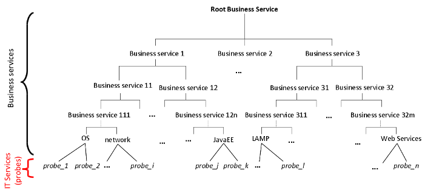
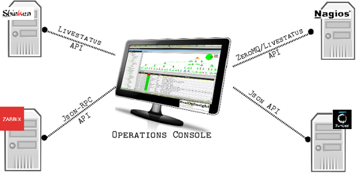

Dashboard Management
*************************************************

This chapter introduces how RealOpInsight manages services and the
dependency tree, alarm messages, as well as how it integrates with 
the underlying monitoring systems.

Dashboard as a Hierarchy of Services
===============================================

The hierarchy of a monitored platform is comprised of two kinds of
services decribed here after:

IT Services  
  Related to monitoring probes (data point in RealOpInsight terminology), 
  those services sit at the bottom of the
  hierarchy. Their statuses are updated periodically through status data
  retrieved from the monitoring servers.

Business Services
  Also called *Business Processes*, they correspond to high level
  services providing value-added to end-users or to applications (e.g.
  operating systems, network devices, applications, database systems,
  storage areas/devices, web engines, a hosting service, a downloading
  service, and so forth).

.. note::

  As illustrated on the figure below, a business service node can have one
  or more sub-services that can be IT services or other business
  services. However, an IT service could has sub-services, and
  additionally, it should be related to an actual probe within the
  underlying monitoring sources. This is a requirement to ensure the
  consistency and the coherency of the service hierarchy.

   
  Illustration of hierarchical business service dashboard

Severity Model and Incident Management
===================================================

To deal with the various models of severity used by the different
underlying monitoring systems, RealOpInsight relies on a unified
severity model. This model comprised of five levels of impacts
(NORMAL, MINOR, MAJOR, CRITICAL, UNKNOWN) is described in the
following table.

+------------+----------------+----------------------+-----------------+
| Severity   | Nagios State   | Zabbix Severity      | Zenoss Severity |
+============+================+======================+=================+
| NORMAL     | OK             | CLEAR                | CLEAR           |
+------------+----------------+----------------------+-----------------+
| MINOR      | -              | INFORMATION, WARNING | DEBUG           |
+------------+----------------+----------------------+-----------------+
| MAJOR      | WARNING        | AVERAGE              | WARNING         |
+------------+----------------+----------------------+-----------------+
| CRITICAL   | CRITICAL       | HIGH, DISASTER       | ERROR, CRITICAL |
+------------+----------------+----------------------+-----------------+
| UNKNOWN    | UNKNOWN        | NOT CLASSIFIED       | -               |
+------------+----------------+----------------------+-----------------+

When an incident enters to the RealOpInsight Engine its severity is
processed and propagated through the service view according to
customized severity calculcation and propagation rules:

+ *A severity calculation rule* allows to determine the status of a
  service *by aggregating the statuses* of its sub-services. Aggregation
  rules currently include high-severity and average severities.
+ *A severity propagation rule* allows to determine how the status of
  a service will be propagated to its parent service. A severity can be
  decreased, increased or leave unchanged.

For more explanation let's take an example: assuming you have a
storage service that relies on two mirrored disks. If one of disks
fails, the storage service will still operate -- even if in a degraded
mode. In such a case, we would not want to report the status of the
storage area as critical. Instead, since it continue to operate but in
+degraded mode, we would want to set its status to major.

RealOpInsight combines five sorts of rules which permit various kinds
of advanced incident management.

+------------------+------------------+------------------------------------------+
| Rule             | Type             | Description                              |
+==================+==================+==========================================+
| HIGH SEVERITY    | Calculation rule | The severity of the related service is   |
|                  |                  | determined by the severity of its sub    |
|                  |                  | service having the highest severity      |
+------------------+------------------+------------------------------------------+
| AVERAGE SEVERITY | Calculation rule | The severity of the related service is   |
|                  |                  | determined by aggregating the severities | 
|                  |                  | of its sub services                      |
+------------------+------------------+------------------------------------------+
| DECREASE         | Propagation rule | The severity of the related service is   |
|                  |                  | decreased before being propagated to     |
|                  |                  | its parent service                       |
+------------------+------------------+------------------------------------------+
| INCREASE         | Propagation rule | The severity of the related service is   | 
|                  |                  | increased before being propagated to its |
|                  |                  | parent service                           |
+------------------+------------------+------------------------------------------+
| UNCHANGED        | Propagation rule | The severity of the related service is   |
|                  |                  | propagated as is to its parent service   |
+------------------+------------------+------------------------------------------+

Advanced Message Management
===================================================
Message customization is one of the key features of RealOpInsight. To
better understand how that works we'll proceed by examples.

Examples
--------------------------------------------------
  
Assume that for monitoring the root partition of a database server, we
have the following definition in our Nagios configuration :

::

    define service{
       use                  local-service 
       host_name            mysql-server
       service_description  Root Partition
       check_command	check_local_disk!30%!10%!/
    }

If the free space on that partition becomes less than 30% (warning
threshold) of the total disk space:

+ Nagios shall report an alert indicating something like " *DISK
  WARNING - free space: / 58483 MB (28% inode=67%)*".
+ Instead of this basis message, RealOpInsight allows you to have a
  more human-comprehensible message such as " *The free space in the
  root partition of the machine mysql-server is less than 30%*".In the
  RealOpInsight Editor, you just need to set a message in the form of "
  *The free space in the root partition of the machine
  {hostname} is less than
  {threshold}*". Here *{hostname}*
  and *{threshold}* are tags that are automaticaly
  replaced at runtime with contextual information.

Contextualization Tags
--------------------------------------------------

There is the list of supported tags (the curly braces are required) :

+ {hostname}: shall be replaced with the hostname
  of the machine to which the incident is related.
+ {threshold}: shall be replaced with the threshold
  defined in the check command. Currently this tag is only supported for
  Nagios.
+ {plugin_output}: shall be replaced with the
  native message returned by the command (e.g. *PING ok - Packet loss =
  0%, RTA = 0.80 ms*)
+ {check_name}: shall be replaced with the name of
  the check component. E.g. *check_local_disk.*

RealOpInsight Architecture and Operation
===============================================

RealOpInsight provides :

+ A native :doc:`WYSIWYG editor <../userguide/editor-manual>`, which is a real studio to create 
  and edit the description of service views in a easy way.
+ A :doc:`Configuration Manager <../adminguide/configuration>` to set the parameters to access the
  underlying monitoring servers.
+ A :doc:`Operations Console <../userguide/oc-manual>` to operate the service 
  views on operations environments.

To make its integration easy, and especially in distributed monitoring
environments, the :ref:`fig-architecture` is a loosely-coupled architecture, 
where every status data are retrieved from the underlying monitoring servers 
only through RPC APIs. This results to a scalable and powerful architecture 
able to handle a large number [#f1]_  of distributed homogeneous/heterogeneous monitoring 
sources simultaneously.

Here are how the Operations Console retrieves data from the underlying
monitoring systems:

+ For Zabbix and Zenoss, it relies on their native RPC APIs : JSON-RPC
  for Zabbix and JSON API for Zenoss.
+ To retrieve data from Nagios, Shinken, Icinga, Groundwork, op5,
  Centreon and other Nagios-derived systems that do not enable native
  APIs, RealOpInsight relies either on Livestatus or on 
  :doc:`ngrt4nd <../adminguide/installing-ngrt4nd>`, a specific daemon 
  enabled on the monitoring server.

.. _fig-architecture:

  
  Architecture of RealOpInsight
 
  This architecture shows how it interact with the different kinds 
  of monitoring systems.

.. [#f1]
  The support of multisource data retrieving has been introduced in the version 2.4 of RealOpInsight. 
  Details concerning the integration are described in the :doc:`configuration guide <../adminguide/configuration>`.

