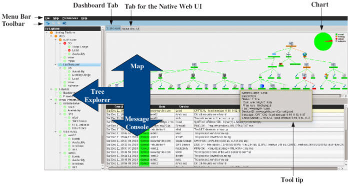

RealOpInsight Operations Console User's Manual
==============================================

This manual presents the user interface as well as the features of
RealOpInsight Operations Console.

Prerequisites
-------------

Ensure that your environment is configured properly. 
Additionally, you would have edited a service view ready use.
If not, read the :doc:`corresponding manual <../userguide/editor-manual>`.

Run the Operations Console
-----------------------------

* On GNU/Linux and OS X Systems:

::

    $ ngrt4n-manager -d <file>
    or
    $ ngrt4n-oc <file>

* On Windows systems:

::

    Start->NGRT4N Monitoring Suite -> RealOpInsight Operations Console

Sign in, then you shall be invited to select a configuration file
through a file selection window.

Overview of the user interface
------------------------------
The user interface shown below consists in four main parts:

+ Menus: accessible via the menu bar or the tools bar.
+ Tree Explorer: gives the preview of the dashboard hierarchy.
+ Map: gives a representation of the dashboard hierarchy.
+ Message Console: shows message about the status of monitored checks.

The Operations Console has been designed so as to be friendly and easy
to use as possible:

+ The map can be zoomed in/out using either menus or more simply
  through the mouse wheel.
+ Each service (node) from the tree or from the map has a context
  menus (enabled by right click) as well as tooltips (activated by mouse
  hoving). The context menu gives access to various functionalities
  allowing for example to filter the messages related to a given
  service. Furthermore, the tooltip enabled on each service provides
  detailed information concerning its different properties (name, status, 
  propagation rule, etc).
+ The message console can be sorted according to every column (date of
  events, severity, hostname, service, and message). Just click on the
  header of the associated column.

  Overview of RealOpInsight Operations Console's user interface
